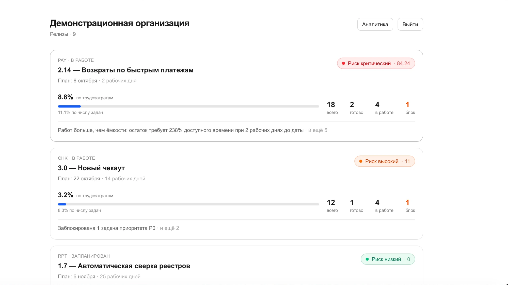
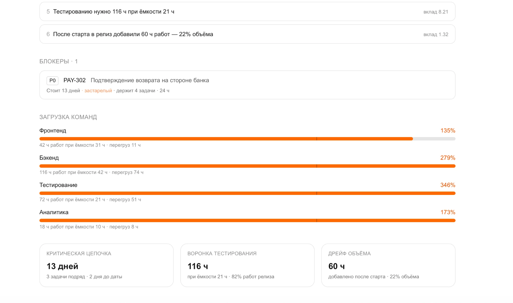
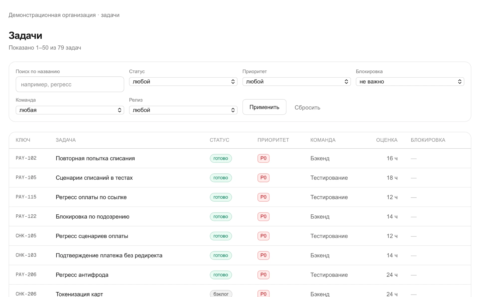
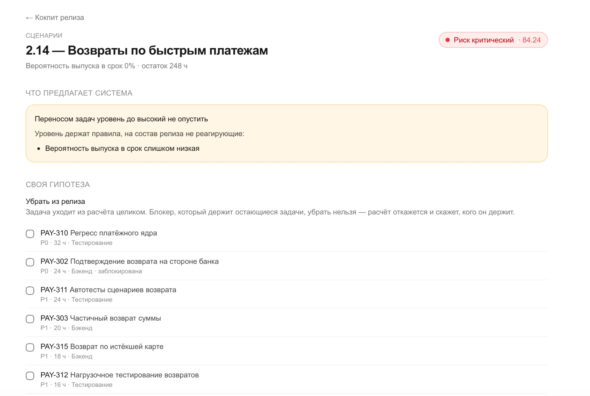
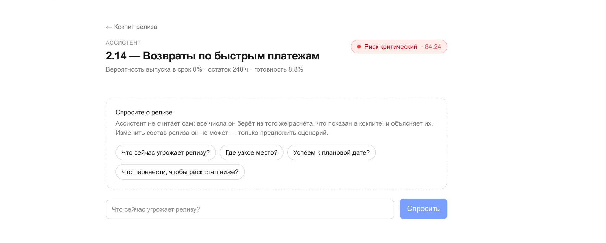
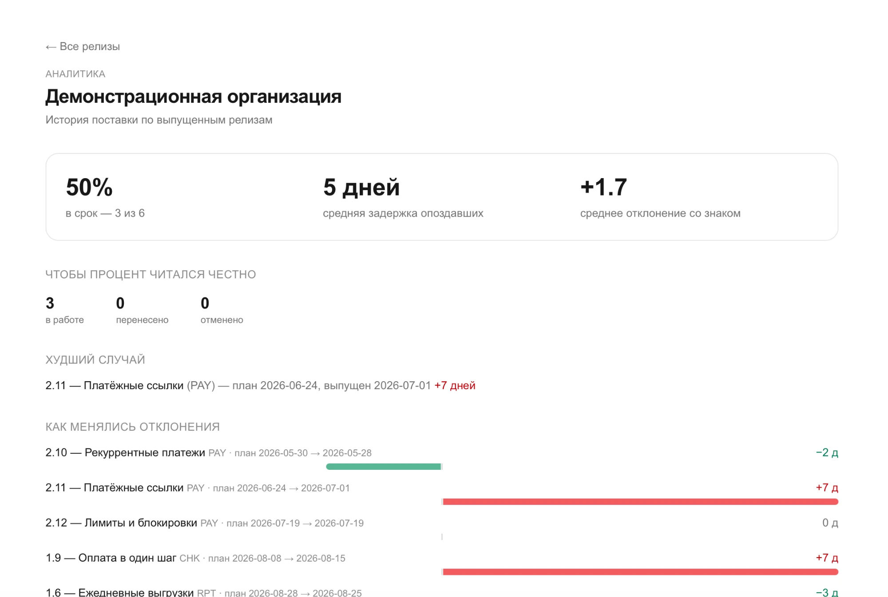

# ReleasePilot AI

> AI-powered Delivery Management Platform — помогает продуктовым командам
> управлять релизами, загрузкой и рисками, и заранее понимать, где delivery
> может сорваться.

**Демо:** https://releasepilot-ai.vercel.app

**Статус:** этап 5 из 5. Домен, API и шесть экранов готовы и развёрнуты;
сквозная проверка `smoke:api` проходит по продакшну целиком (59 проверок).
Осталась финализация — скриншоты и презентация.

---

## Проблема

Delivery Manager узнаёт о срыве релиза за 2–3 дня до даты, когда сделать уже
ничего нельзя. Загрузка команд нигде не посчитана, цепочки блокеров не видны, а
на вопрос «успеем ли к четвергу» нет ответа в терминах вероятности.

## Решение

Кокпит текущего релиза + детерминированный движок расчёта риска + AI Delivery
Assistant, который объясняет причины риска и **симулирует** сценарии его
снижения:

```
Release 2.14                         План: 24 октября (через 7 рабочих дней)
Готовность 72.5%   Риск HIGH 84.2   Вероятность выпуска в срок 0%

Почему High
  1. Тестирование загружено на 173%          вклад 24  → к загрузке
  2. PAY-302 держит 4 задачи, блокер застарел вклад 18  → к блокерам
  3. Критическая цепочка 9.8 д при 7 остатка  вклад 14  → к цепочке

Сценарии → убрать 2 задачи: скор 84.2 → 52.8, уровень High → Medium
```

## Ключевой архитектурный принцип

**Цифры считает код, объясняет их модель.** Готовность, загрузка, уровень риска
и вероятность выпуска рассчитываются детерминированным движком, покрытым
юнит-тестами. Модель получает готовые числа и отвечает за интерпретацию и
рекомендации — вычислять ей запрещено, а числа в её ответе сверяются с теми,
что ей давали (`src/lib/agent/verify.ts`). Это исключает расхождение между
экраном и ответом ассистента.

Движок — чистые функции: ни базы, ни сети, ни `Date.now()`. Момент времени
передаётся снимком снаружи, поэтому расчёт воспроизводим, а тесты не зависят
от дня запуска.

## Экраны

| Экран | Что отвечает |
|---|---|
| Список релизов | где горит: сортировка по срочности, не по дате |
| Кокпит релиза | риск и причины с вкладом, готовность, загрузка команд, блокеры, цепочка |
| Задачи | список с фильтрами в адресе — ссылка из причины риска ведёт на свои задачи |
| Сценарии | подбор «что перенести», ручной what-if, применение с подтверждением |
| AI-ассистент | диалог потоком, видимые вызовы инструментов, предложения карточкой |
| Аналитика | доля релизов в срок, задержки, динамика отклонений |

У каждого — три состояния: загрузка, ошибка, пусто (NFR-06).

## Технологии

Next.js 16 (App Router) · TypeScript strict · Tailwind CSS 4 · Supabase
(PostgreSQL, Auth, RLS) · Claude API (tool use, стриминг) · Vitest ·
GitHub Actions · Vercel

## Запуск

```bash
npm install
cp .env.example .env.local   # заполнить ключи Supabase и, при желании, Claude API
npm run seed:demo            # демо-организация, шесть выпущенных релизов, задачи
npm run dev
```

Миграции применяются в SQL-редакторе Supabase по порядку:
`supabase/migrations/0001_initial_schema.sql`, затем `0002`, `0003`.

Ассистент работает только с `ANTHROPIC_API_KEY`. Без ключа он отвечает
«недоступен», а остальное приложение — метрики, прогноз, сценарии — работает
полностью: это требование NFR-07, и оно проверяется.

## Проверки

```bash
npm run lint
npm run typecheck      # next typegen && tsc --noEmit
npm test               # 330 тестов, домен и слои перевода на фикстурах
npm run check:db       # схема базы против сгенерированных типов
npm run smoke:api      # сквозная проверка чтения через настоящие маршруты
npm run smoke:scenario # сквозная проверка записи: сценарии, связи, ёмкость, импорт
```

`smoke:api` только читает и ничего не портит. `smoke:scenario` **пишет**:
создаёт свой временный релиз, проверяет сохранение и применение сценария,
связи задач, ёмкость и импорт, и убирает за собой даже после падения. Записи в
журнале изменений остаются — журнал только дописывается, и проверка не
исключение из правила, которое она проверяет.

Обе сквозные проверки требуют запущенного `npm run dev` и демо-данных.

## Деплой

Vercel, переменные окружения те же, что в `.env.example`. Обязательны
`NEXT_PUBLIC_SUPABASE_URL`, `NEXT_PUBLIC_SUPABASE_ANON_KEY`,
`SUPABASE_SERVICE_ROLE_KEY`; `ANTHROPIC_API_KEY` — только для ассистента;
`CRON_SECRET` — для ежедневной записи снимков метрик. Токены Yandex Tracker в
публичный деплой не добавляются.

Адрес сайта задавать не нужно: ссылка подтверждения почты строится из адреса
запроса. Но в Supabase (Authentication → URL Configuration) этот адрес обязан
быть в списке Redirect URLs — иначе Supabase отправит человека по ссылке из
письма на Site URL, то есть на `localhost`.

Проверка продакшна — та же сквозная проверка, направленная на сайт:

```bash
SMOKE_BASE_URL=https://releasepilot-ai.vercel.app npm run smoke:api
```

`vercel.json` описывает одну задачу по расписанию: `/api/cron/snapshot`
ежедневно в 06:00 UTC. Она снимает метрики всех открытых релизов и пишет их в
`release_snapshots` (FR-39) — на этих снимках строится ответ на вопрос, какие
причины риска повторяются из релиза в релиз (FR-37). Без `CRON_SECRET` маршрут
отвечает «не настроено» и ничего не делает: внутри он работает
административным клиентом, в обход политик RLS, и открытым быть не может.

Публичное демо обязано остаться в `APP_MODE=demo` (ADR-002): синтетические
данные, доступ к корпоративному трекеру выключен.

## Структура

```
src/
  domain/        движок: метрики, риск, прогноз, сценарии, подбор, аналитика
                 чистые функции, 0 обращений к базе и сети
  lib/
    data/        чтение и запись: снимки, контекст расчёта, импорт, сценарии
    api/         перевод домена в ответы API (camelCase, Infinity → null)
    agent/       инструменты, промпт, уровни передачи данных, сверка чисел
    import/      разбор CSV и JSON, план импорта
    validation/  схемы Zod — одна на запрос
    ui/          подписи и форматирование
  app/api/       маршруты: тонкие, без формул
  app/org/       экраны
supabase/migrations/   схема, RLS, функции
docs/                  документация проекта
```

## Документация

| Документ | Описание |
|---|---|
| [Устав проекта](docs/01-charter.md) | цели, границы, риски, вехи |
| [Требования](docs/04-srs.md) | FR, NFR, трассировка на user stories |
| [Концепция интерфейса](docs/05-ui-concept.md) | экраны, состояния, что сознательно не делается |
| [База данных](docs/06-database.md) | схема, индексы, политики |
| [API и AI-ассистент](docs/07-api-and-agent.md) | эндпоинты, формат импорта, инструменты агента |
| [ADR](docs/adr/) | движок риска, режимы развёртывания, модель безопасности |
| [AI Journal](AI_JOURNAL.md) | применение AI-агентов на всех этапах |

## Скриншоты

Сняты с продакшна, демо-организация, синтетические данные.

**Список релизов** — сортировка по срочности, а не по дате: сверху то, что горит.



**Кокпит релиза** — причины риска с вкладом, блокеры, загрузка команд. Загрузка
выше 100% показана перегрузом в часах, а не только процентом.



**Задачи** — фильтры живут в адресе, поэтому причина риска в кокпите ведёт
ссылкой ровно на свои задачи.



**Сценарии** — подбор отвечает «недостижимо» и называет правило, которое держит
уровень: здесь перенос задач риск не снизит, нужна другая мера.



**Ассистент** — без ключа Claude API отвечает «недоступен», а всё остальное
работает (NFR-07).



**Аналитика** — доля в срок, средняя задержка по опоздавшим и среднее
отклонение рядом: порознь они вводят в заблуждение.



---

Учебный проект. Демо работает на синтетических данных: ни одной строки из
реальных систем.
