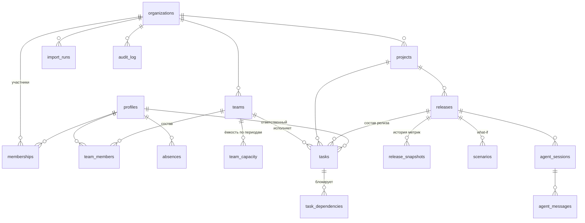

# Схема базы данных

**СУБД:** PostgreSQL 15 (Supabase)
**Миграция:** [`supabase/migrations/0001_initial_schema.sql`](../supabase/migrations/0001_initial_schema.sql)
**Таблиц:** 17 (требование курса — минимум 3 связанные)

---

## ER-диаграмма



---

## Таблицы

### Организации и доступ

| Таблица | Назначение |
|---|---|
| `organizations` | арендатор системы; корень изоляции данных |
| `profiles` | профиль пользователя, расширяет `auth.users` Supabase |
| `memberships` | связь пользователя с организацией и его роль |

### Команды и ёмкость

| Таблица | Назначение |
|---|---|
| `teams` | Frontend, Backend, QA, Analytics, Design |
| `team_members` | состав команды с долей занятости участника |
| `team_capacity` | доступные часы команды на период — знаменатель в расчёте загрузки |
| `absences` | отпуска и отсутствия, вычитаются из ёмкости |

### Работа

| Таблица | Назначение |
|---|---|
| `projects` | проект с буквенным ключом (например, `PPT`) |
| `releases` | релиз: плановая дата, статус, фактический выпуск |
| `tasks` | задача: статус, приоритет, оценка, команда, ответственный |
| `task_dependencies` | граф зависимостей «блокирует / связана» |

### Аналитика и агент

| Таблица | Назначение |
|---|---|
| `release_snapshots` | ежедневные снимки метрик — основа истории и трендов |
| `scenarios` | сохранённые what-if сценарии и результат их применения |
| `agent_sessions` | диалоги с AI-ассистентом |
| `agent_messages` | сообщения, вызовы инструментов, расход токенов |

### Служебные

| Таблица | Назначение |
|---|---|
| `import_runs` | запуски импорта с построчным отчётом об ошибках |
| `audit_log` | журнал изменений, только добавление |

---

## Решения, принятые при проектировании

### 1. `org_id` на каждой содержательной таблице

Денормализация сделана осознанно. Без `org_id` политика RLS для задач
вынуждена идти по цепочке `task → project → organization` на каждой строке.
С прямым полем проверка выполняется по индексу.

Цена — необходимость поддерживать согласованность `org_id` с родителем; это
делает серверный слой, а нарушение ловится тестом.

### 2. Снимки метрик хранятся как `jsonb`

`release_snapshots.metrics` — полный `ReleaseMetrics` целиком, а не разложенный
по колонкам.

Причина: **формулы расчёта риска будут меняться при калибровке.** Если хранить
факторы колонками, изменение формулы перепишет смысл исторических данных и
сравнение релизов между собой потеряет смысл. Снимок фиксирует, как система
оценивала релиз *в тот момент*, — это неизменяемый исторический факт.

Ключевые поля для выборок (`risk_level`, `risk_score`, `readiness_pct`,
`probability_on_time`) продублированы отдельными колонками, чтобы не разбирать
JSON при построении трендов.

### 3. Запрет циклов на уровне БД, а не приложения

Цикл в графе зависимостей приводит к бесконечному обходу при расчёте
критической цепочки. Проверка реализована триггером с рекурсивным CTE:
перед вставкой связи проверяется, не достижима ли блокирующая задача из
заблокированной.

Почему в базе, а не в коде: ограничение целостности данных должно жить там,
где живут данные. Импорт, миграция, ручная правка через SQL-консоль — все пути
записи проходят через триггер, тогда как проверку в приложении обходит любой
из них.

### 4. `estimate_h` обязательна и строго положительна

На оценке держится весь расчёт: готовность по трудозатратам, загрузка команд,
прогноз. Задача без оценки делает метрики релиза недостоверными, поэтому
ограничение стоит на уровне схемы, а не только в форме ввода.

### 5. Диалоги с агентом приватны даже от владельца организации

Политика на `agent_sessions` и `agent_messages` разрешает доступ только автору
переписки. Delivery Manager спрашивает у системы вещи вроде «почему команда QA
постоянно срывает сроки» — это рабочие размышления, а не общий документ.

### 6. Журнал изменений без политик `update` и `delete`

Их отсутствие — не упущение, а решение. RLS запрещает всё, что не разрешено
явно, поэтому записи журнала физически невозможно изменить или удалить через
клиентский доступ, включая владельца организации.

### 7. `blocked_since`, а не булев флаг

Хранится момент начала блокировки, а не признак «заблокирована». Из отметки
времени выводится и флаг, и длительность — а длительность нужна и фактору F3,
и признаку застарелого блокера.

---

## Индексы

| Индекс | Зачем |
|---|---|
| `tasks (org_id, release_id)` | основной запрос кокпита — состав релиза |
| `tasks (org_id, status)` | группировка по статусам |
| `tasks (release_id) where blocked_since is not null` | частичный индекс: реестр блокеров |
| `tasks using gin (title gin_trgm_ops)` | поиск по подстроке, требование NFR-02 (≤300 мс) |
| `task_dependencies (blocker_task_id)`, `(blocked_task_id)` | обход графа в обе стороны |
| `release_snapshots (release_id, captured_at desc)` | последний снимок и построение тренда |
| `memberships (user_id)`, `(org_id)` | вызывается политиками RLS на каждый запрос |

---

## Проверка схемы

Миграция применяется локально через Supabase CLI:

```bash
supabase start
supabase db reset          # применяет миграции с нуля
```

Набор проверок после применения:

- [ ] все 17 таблиц созданы, RLS включён на каждой
- [ ] попытка вставить циклическую зависимость отклоняется триггером
- [ ] задача с `estimate_h = 0` не создаётся
- [ ] пользователь организации A не видит задачи организации B
- [ ] `update` и `delete` записи `audit_log` отклоняются политикой
- [ ] `viewer` не может изменить задачу
